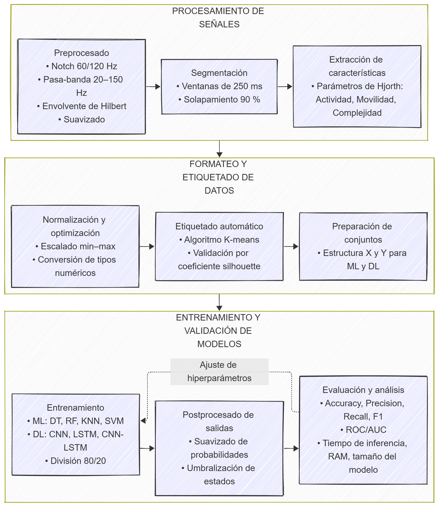

# DESEMPEÑO COMPARATIVO DE TÉCNICAS DE APRENDIZAJE AUTOMÁTICO Y PROFUNDO EN LA CLASIFICACIÓN DE ACTIVIDAD MUSCULAR USANDO EMG DEL BÍCEPS

Repositorio de proyecto de grado bajo la modalidad pasantia de investigacion para el grupo MAGMA ingenieria de la Universidad del Magdalena, linea de bioingeniería, Incluye dependencias de paquetes, comandos y configuraciones del proyecto. Además, proporciona gráficos relacionados con el preprocesamiento de datos y un gráfico que muestra los resultados de uno de varios experimentos realizados como parte de la investigación de grado en ingeniería electrónica en la Universidad del Magdalena.

---
> **Correo de contacto:**  
> luisretamozoar@unimagdalena.edu.co
---

## Descripción del proyecto

Este proyecto presenta el desarrollo de un **estudio comparativo** entre técnicas de **aprendizaje automático** (como *DT*, *RF*, *KNN* y *SVM*) y **aprendizaje profundo** (*CNN*, *LSTM* y *CNN-LSTM*), aplicadas a **señales sEMG** del **bíceps braquial** para la **clasificación de estado sobre la actividad muscular**.

El estudio forma parte de una **investigación de grado en Ingeniería eletrónica**, enfocada en el desarrollo de **herramientas de apoyo** para proyectos de **reconocimiento de patrones musculares**.

---

## Metodología

---

## Resultados

Los resultados experimentales muestran que las **técnicas profundas superan a las tradicionales** en precisión promedio:

| Modelo       | Precisión | Recall  | F1-Score | Exactitud | Tiempo de inferencia (S) | Desviación Estándar (S) | Uso de RAM (MB) | Espacio en disco (MB) |
|---------------|------------|----------|-----------|------------|----------------------------|---------------------------|------------------|------------------------|
| Decision Tree | 0.975      | 0.98     | 0.975     | 0.97       | 0.01                       | 0.002                     | 342              | 0.03                   |
| Random Forest | 0.985      | 0.98     | 0.985     | 0.984      | 0.0411                     | 0.008                     | 405              | 12.1                   |
| KNN           | 0.975      | 0.99     | 0.98      | 0.98       | 1.5                        | 0.3                       | 356              | 10                     |
| SVM           | 0.9999     | 0.9997   | 0.9998    | 0.99       | 19.89                      | 2.338                     | 637              | 0.1                    |
| CNN           | 0.9997     | 0.9997   | 0.9997    | 0.9997     | 0.15                       | 0.02                      | 1661.48          | 0.0607                 |
| LSTM          | 0.9992     | 0.9992   | 0.9992    | 0.9992     | 0.12                       | 0.023                     | 1100.48          | 0.2509                 |
| CNN-LSTM      | 0.999      | 0.9993   | 0.999     | 0.9992     | 0.18                       | 0.193                     | 1300             | 0.36                   |

Se realizó una **prueba t-Student**, concluyendo que las diferencias entre ambos enfoques son **estadísticamente significativas**.  
Los modelos profundos también demostraron **mayor robustez ante la variabilidad inter-sujeto**, funcionando como un **enfoque híbrido eficiente** en términos de **error y tiempo computacional**.

---

## Herramientas desarrolladas

- Herramienta de Clasificación EMG  
- Herramienta de Clasificación EMG + Extracción de Características

---

## Figura

> **Figura:** Rendimiento comparativo de técnicas (profundas vs. automáticas) con clasificadores variados.  
> *Creación propia.*

---

## Investigación adicional

- Integración de técnicas híbridas (ML + DL).  
- Evaluación con métricas adicionales: *ROC-AUC*, *Confusion Matrix Ranking*.  
- Aplicación de rankings iterativos para selección de características candidatas.  
- Uso de clustering para eliminar redundancias en las características musculares.

---

## Contacto

✉️ [tu-email]@gmail.com  
*(Reemplaza con tu correo real).*
